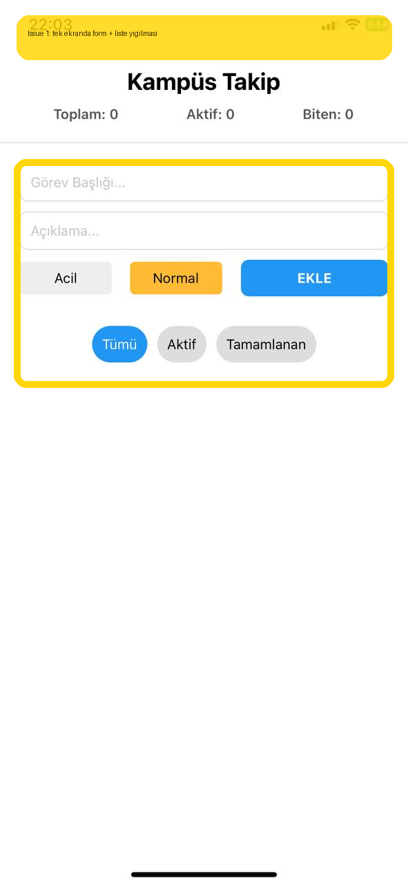

# Bug Raporu - Kampus Takip (Legacy Host)

**Tarih:** 2026-05-20 22:45  
**Toplam:** 1 not · 🔴 1 acik

---

## Ekran: /legacy-home

### 🔴 #1 - Gorev olusturma formu ile filtreli liste ayni ekranda yigiliyor; ilk acilista odak dagiliyor ve FAB ile alinacak audit notlari da liste ustune biniyor.

- **Durum:** Acik
- **Zaman:** 2026-05-20 22:45
- **Raporlayan:** 9191118048
- **Beklenen:** Gorev olusturma ayri route'a tasinsin, ana panel yalnizca akisi ve task ozetlerini gostersin.
- **Agent girdisi:** `READ -> ayri route ihtiyacini dogrula -> LOCATE legacy home composition -> HYPOTHESIZE expo-router ayirimi -> REPAIR -> TEST typecheck`

---
