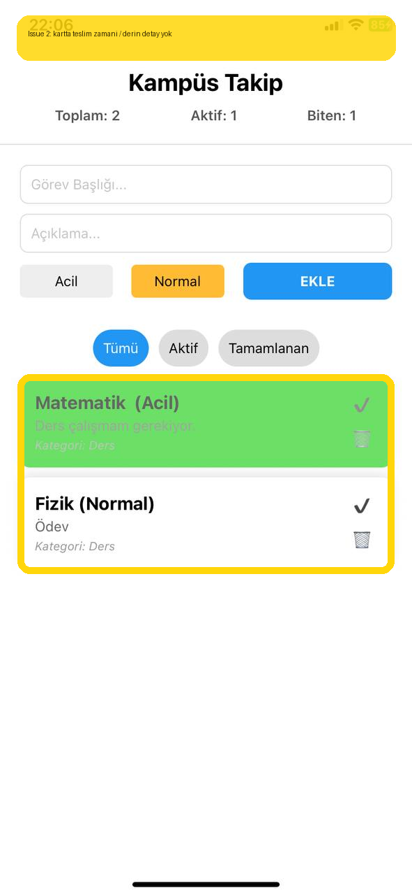

# Bug Raporu - Kampus Takip (Legacy Host)

**Tarih:** 2026-05-20 22:51  
**Toplam:** 1 not · 🔴 1 acik

---

## Ekran: /legacy-task-list

### 🔴 #1 - Gorev kartlari teslim zamani ve detay baglamini gostermiyor; kullanici karttan gorevin ne zaman bitecegini anlayamiyor.

- **Durum:** Acik
- **Zaman:** 2026-05-20 22:51
- **Raporlayan:** 9191118048
- **Beklenen:** Kartta zaman etiketi olsun, detay route'u gorevin durumunu ayri blokta gostersin, state hydration sirasinda yalanci liste flash'i olmasin.
- **Agent girdisi:** `READ -> LOCATE task card + detail gaps -> HYPOTHESIZE metadata surfacing + hydration guard -> REPAIR -> TEST typecheck`

---
