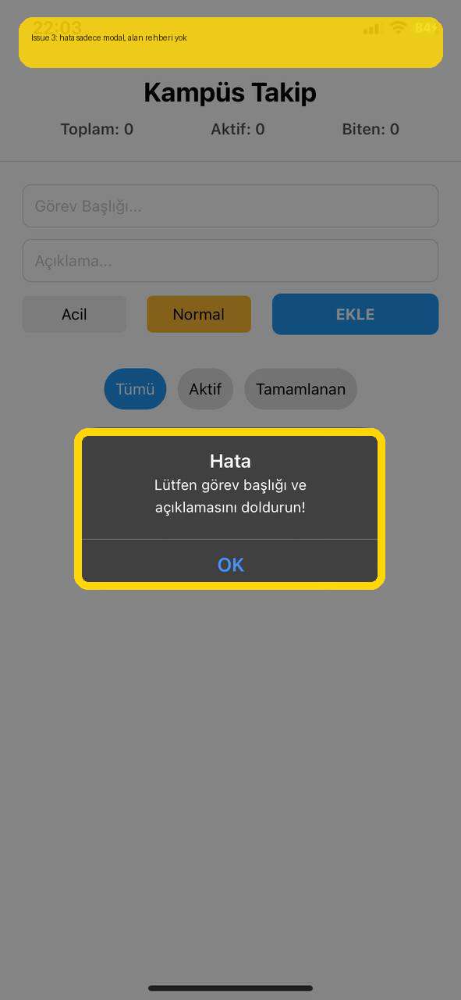

# Bug Raporu - Kampus Takip (Legacy Host)

**Tarih:** 2026-05-20 22:58  
**Toplam:** 1 not · 🔴 1 acik

---

## Ekran: /legacy-create-modal

### 🔴 #1 - Bos form gonderiminde sadece modal hata gorunuyor; hangi alanin eksik oldugu ekrandan anlasilmiyor.

- **Durum:** Acik
- **Zaman:** 2026-05-20 22:58
- **Raporlayan:** 9191118048
- **Beklenen:** Form icinde alan bazli rehber, helper copy ve disabled submit davranisi olsun.
- **Agent girdisi:** `READ -> LOCATE submit validation -> HYPOTHESIZE inline helper + disabled CTA -> REPAIR -> TEST typecheck`

---
